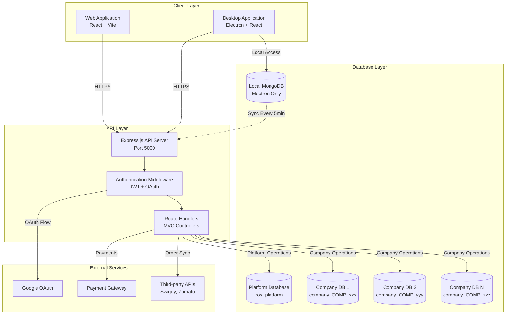
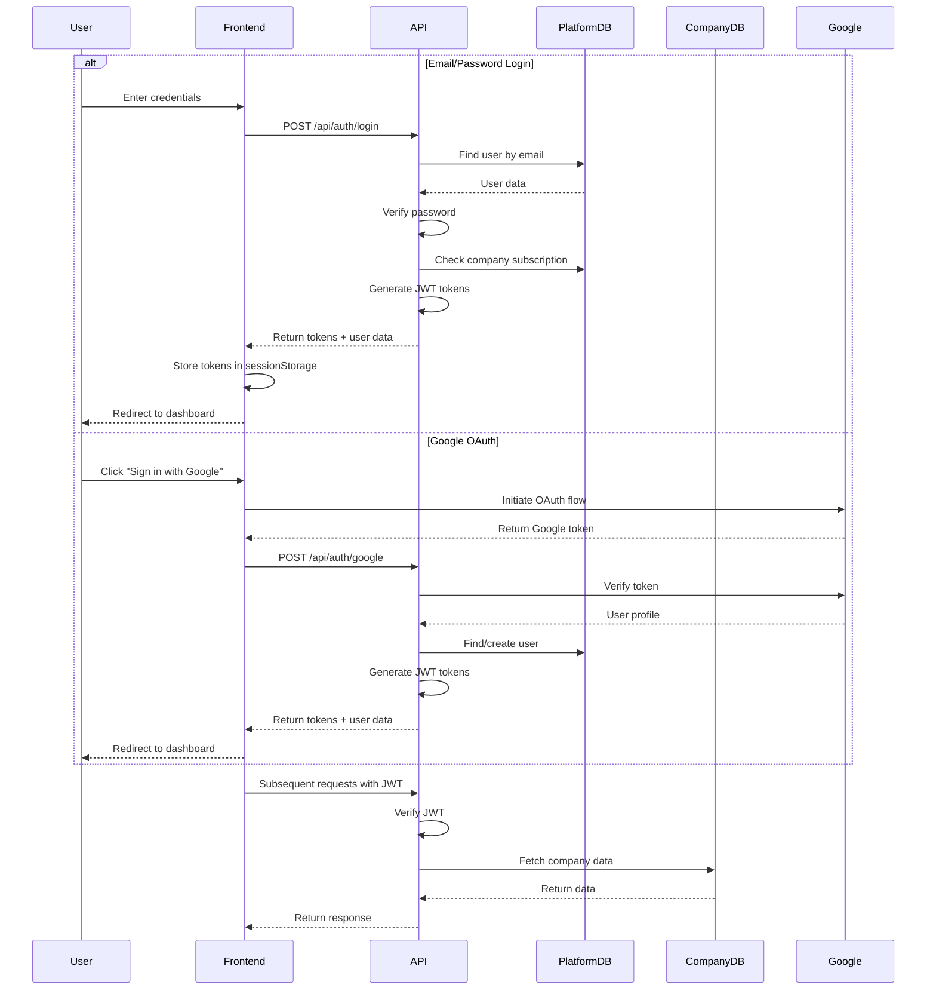

# Restaurant Operating System (ROS) - Design Document

## Overview

The Restaurant Operating System (ROS) is a comprehensive full-stack web and desktop application designed to streamline restaurant operations. The system provides an all-in-one platform for billing, inventory management, staff management, customer relationship management, and analytics.

### Key Design Principles

1. **Multi-Tenancy with Database Isolation**: Each company operates in a completely isolated database, ensuring data security and scalability
2. **Offline-First Architecture**: Desktop application works seamlessly without internet connectivity, syncing data when connection is restored
3. **Role-Based Access Control**: Granular permissions system supporting platform admins and company-level roles
4. **Modular Design**: Features organized into independent modules that can be enabled/disabled per company
5. **Scalability**: Architecture supports multiple branches per company and unlimited transactions

### Technology Stack

**Backend**:
- Node.js with Express.js (MVC architecture)
- MongoDB (Platform DB + per-company databases)
- JWT authentication with Google OAuth
- Socket.IO for real-time features

**Frontend**:
- React with Vite
- Tailwind CSS + Radix UI components
- Axios for API communication
- Context API/Zustand for state management

**Desktop**:
- Electron wrapper around React frontend
- Local MongoDB instance for offline operation
- Bidirectional sync every 5 minutes

---

## Architecture

### System Architecture Diagram



### Database Architecture

#### Platform Database (`ros_platform`)

**Purpose**: Stores platform-level data and company registry

**Collections**:
- `platformadmins`: Platform super admin users
- `companies`: Company registry and metadata
- `users`: Initial company super admin (created during registration)
- `environmentconfigs`: Backend environment variables
- `platformconfigs`: Platform-wide settings
- `refreshtokens`: JWT refresh tokens

**Access Control**: Only platform super admins can access this database

#### Company Databases (`company_<companyId>`)

**Purpose**: Isolated database per company containing all operational data

**Collections** (per company):
- `companyusers`: All users within the company
- `companysettings`: Company-specific configurations
- `branches`: Branch locations
- `menucategories`, `menuitems`: Menu management
- `inventory`: Raw materials and finished goods
- `orders`, `invoices`: Billing and transactions
- `employees`, `attendance`: Staff management
- `customers`: CRM data

**Access Control**: Only users belonging to that company can access their database

**Database Creation**: Automatically created during company registration with initial settings

### Authentication Flow



### Role-Based Access Control

**Platform Level**:
- `platform_super_admin`: Full access to platform database, all companies, subscription management

**Company Level**:
- `company_super_admin_primary`: Created during registration, full company access, cannot be deleted
- `company_super_admin_secondary`: Additional super admins, full company access
- `company_admin`: Branch-level admin, limited to assigned branches
- `employee`: Basic access, limited to assigned branches and modules

**Permission Matrix**:

| Feature | Platform Admin | Company Super Admin | Company Admin | Employee |
|---------|---------------|---------------------|---------------|----------|
| View all companies | ✓ | ✗ | ✗ | ✗ |
| Manage subscriptions | ✓ | ✗ | ✗ | ✗ |
| Create company users | ✗ | ✓ | ✓ (branch only) | ✗ |
| Manage menu | ✗ | ✓ | ✓ (branch only) | ✗ |
| Create orders | ✗ | ✓ | ✓ | ✓ |
| View reports | ✓ (all) | ✓ (company) | ✓ (branch) | ✗ |
| Manage inventory | ✗ | ✓ | ✓ (branch only) | ✗ |

---

## Components and Interfaces

### Backend Components

#### 1. Authentication Module

**Controllers**: `authController.js`

**Key Functions**:
```javascript
// Register new company with trial subscription
registerCompany(req, res, next)
  Input: { companyName, email, password, phone, address, adminName, ... }
  Output: { user, company, token, refreshToken }
  Side Effects: 
    - Creates user in Platform DB
    - Creates company in Platform DB
    - Creates dedicated company database
    - Initializes company settings
    - Activates 30-day trial

// Login with email/password
login(req, res, next)
  Input: { email, password }
  Output: { user, token, refreshToken }
  Validations:
    - User exists and is active
    - Password matches
    - Company subscription is active
    - Company is not suspended

// Google OAuth login
googleLogin(req, res, next)
  Input: { token: googleToken }
  Output: { user, token, refreshToken }
  Side Effects:
    - Verifies Google token
    - Creates user if not exists
    - Updates Google ID and profile picture

// Get current user profile
getMe(req, res, next)
  Input: JWT token in header
  Output: { user, company }
  
// Logout
logout(req, res, next)
  Input: { refreshToken }
  Side Effects: Revokes refresh token
```

**Middleware**: `auth.js`

```javascript
// Verify JWT and attach user to request
authenticate(req, res, next)
  Input: Authorization header with Bearer token
  Output: req.user = { userId, email, role, companyId, branchIds }
  Throws: 401 if token invalid or expired

// Check if user has required role
authorize(...allowedRoles)
  Input: Array of allowed roles
  Output: Calls next() if authorized
  Throws: 403 if insufficient permissions
```

#### 2. Database Connection Module

**File**: `config/database.js`

**Key Functions**:
```javascript
// Connect to platform database
connectPlatformDB()
  Side Effects:
    - Establishes connection to ros_platform
    - Loads environment configs from database
    - Overrides process.env with DB values

// Load environment variables from Platform Admin DB
loadEnvironmentConfigsFromDB()
  Side Effects:
    - Finds Platform Admin Primary user
    - Fetches EnvironmentConfig document
    - Decrypts sensitive values (JWT_SECRET, etc.)
    - Updates process.env

// Get connection to specific company database
getCompanyDB(companyId)
  Input: companyId string
  Output: Mongoose connection to company_<companyId>
  Side Effects: Creates connection if doesn't exist
```

#### 3. Environment Configuration Module

**Model**: `EnvironmentConfig`

**Purpose**: Store all backend environment variables in database for centralized management

**Schema**:
```javascript
{
  platformAdminPrimaryId: ObjectId,  // Reference to primary admin
  configs: {
    PORT: Number,
    NODE_ENV: String,
    PLATFORM_DB_URI: String,
    COMPANY_DB_BASE_URI: String,
    JWT_SECRET: String (encrypted),
    JWT_EXPIRE: String,
    GOOGLE_CLIENT_ID: String,
    GOOGLE_CLIENT_SECRET: String (encrypted),
    GOOGLE_CALLBACK_URL: String,
    FRONTEND_URL: String,
    customConfigs: Map<String, String>
  },
  lastModifiedBy: ObjectId,
  lastModifiedAt: Date,
  isActive: Boolean
}
```

**Methods**:
```javascript
// Decrypt sensitive configuration value
getDecryptedConfig(configKey)
  Input: Configuration key name
  Output: Decrypted value
  Algorithm: AES-256-CBC with scrypt key derivation
```

### Frontend Components

#### 1. Authentication Context

**File**: `context/AuthContext.jsx`

**State**:
```javascript
{
  user: {
    id, name, email, role, companyId, branchIds, profilePicture
  },
  company: {
    companyId, companyName, subscription, modules
  },
  loading: Boolean,
  isAuthenticated: Boolean
}
```

**Methods**:
```javascript
login(email, password)
  - Calls API login endpoint
  - Stores tokens in sessionStorage
  - Updates context state
  - Returns user data

googleLogin(googleToken)
  - Calls API Google OAuth endpoint
  - Stores tokens in sessionStorage
  - Updates context state

register(data)
  - Calls API register-company endpoint
  - Stores tokens in sessionStorage
  - Updates context state

logout()
  - Calls API logout endpoint
  - Clears sessionStorage
  - Resets context state

checkAuth()
  - Called on app initialization
  - Verifies stored token
  - Fetches current user data
```

#### 2. Layout Components

**Platform Admin Layout**:
- Dark theme with platform branding
- Sidebar navigation with platform-specific menu
- Access to: Companies, Subscriptions, Platform Settings, Analytics

**Company User Layout**:
- Green/white/black theme
- Sidebar navigation with company-specific menu
- Branch selector (if multi-branch)
- Access to: Dashboard, Billing, Menu, Inventory, Staff, Reports, Settings

**Layout Selection Logic**:
```javascript
function getLayoutForUser(user) {
  if (user.role === 'platform_super_admin') {
    return <PlatformAdminLayout />;
  } else {
    return <CompanyUserLayout />;
  }
}
```

#### 3. Protected Route Component

```javascript
<ProtectedRoute allowedRoles={['company_super_admin', 'company_admin']}>
  <MenuManagement />
</ProtectedRoute>
```

**Logic**:
- Checks if user is authenticated
- Verifies user role matches allowed roles
- Redirects to login if not authenticated
- Shows 403 error if insufficient permissions

### API Endpoints

#### Authentication Endpoints

```
POST /api/auth/register-company
  Body: { companyName, email, password, phone, address, adminName, gstNumber, fssaiLicense }
  Response: { success, message, data: { user, company, token, refreshToken } }
  Status: 201 Created

POST /api/auth/login
  Body: { email, password }
  Response: { success, message, data: { user, token, refreshToken } }
  Status: 200 OK

POST /api/auth/google
  Body: { token: googleToken }
  Response: { success, message, data: { user, token, refreshToken } }
  Status: 200 OK

GET /api/auth/me
  Headers: Authorization: Bearer <token>
  Response: { success, data: { user, company } }
  Status: 200 OK

POST /api/auth/logout
  Headers: Authorization: Bearer <token>
  Body: { refreshToken }
  Response: { success, message }
  Status: 200 OK
```

---

## Data Models

### Platform Database Models

#### PlatformAdmin

```javascript
{
  _id: ObjectId,
  name: String (required),
  email: String (required, unique, lowercase),
  password: String (required, hashed, select: false),
  role: String (default: 'platform_super_admin', immutable),
  profilePicture: String,
  isActive: Boolean (default: true),
  lastLogin: Date,
  createdAt: Date,
  updatedAt: Date
}
```

**Indexes**: `email` (unique)

**Methods**:
- `comparePassword(candidatePassword)`: Verify password using bcrypt

**Hooks**:
- `pre('save')`: Hash password before saving if modified

#### Company

```javascript
{
  _id: ObjectId,
  companyId: String (required, unique),  // Format: COMP_<timestamp>_<random>
  companyName: String (required),
  email: String (required, unique),
  phone: String,
  address: String,
  gstNumber: String,
  fssaiLicense: String,
  
  databaseName: String (required),  // Format: company_<companyId>
  databaseConnectionString: String,
  
  subscription: {
    status: String (enum: ['trial', 'active', 'grace_period', 'suspended', 'expired'], default: 'trial'),
    plan: String (default: 'monthly'),
    trialStartDate: Date,
    trialEndDate: Date,
    trialUsed: Boolean (default: false),
    subscriptionStartDate: Date,
    nextBillingDate: Date,
    autoRenewal: Boolean (default: false)
  },
  
  primaryAdmin: {
    userId: ObjectId (ref: 'User'),
    name: String,
    email: String
  },
  
  modules: {
    billing: Boolean (default: true),
    inventory: Boolean (default: true),
    crm: Boolean (default: false),
    integrations: Boolean (default: false),
    loyalty: Boolean (default: false),
    analytics: Boolean (default: true),
    staffManagement: Boolean (default: true),
    kds: Boolean (default: false)
  },
  
  isActive: Boolean (default: true),
  createdAt: Date,
  updatedAt: Date
}
```

**Indexes**: 
- `companyId` (unique)
- `email` (unique)
- `subscription.status`

#### User (Platform DB)

```javascript
{
  _id: ObjectId,
  name: String (required),
  email: String (required, unique, lowercase),
  password: String (hashed, select: false),
  googleId: String,
  profilePicture: String,
  role: String (enum: ['company_super_admin_primary'], required),
  companyId: String (ref: 'Company', required),
  isActive: Boolean (default: true),
  createdAt: Date,
  updatedAt: Date
}
```

**Note**: This model is only used during company registration. After registration, all company users are stored in their respective company databases.

**Indexes**: `email` (unique)

#### EnvironmentConfig

```javascript
{
  _id: ObjectId,
  platformAdminPrimaryId: ObjectId (ref: 'PlatformAdmin', required),
  configs: {
    PORT: Number (default: 5000),
    NODE_ENV: String (enum: ['development', 'production', 'staging'], default: 'development'),
    PLATFORM_DB_URI: String (required),
    COMPANY_DB_BASE_URI: String (required),
    JWT_SECRET: String (required, encrypted, select: false),
    JWT_EXPIRE: String (default: '7d'),
    GOOGLE_CLIENT_ID: String (select: false),
    GOOGLE_CLIENT_SECRET: String (encrypted, select: false),
    GOOGLE_CALLBACK_URL: String,
    FRONTEND_URL: String (default: 'http://localhost:5173'),
    customConfigs: Map<String, String>
  },
  lastModifiedBy: ObjectId (ref: 'PlatformAdmin'),
  lastModifiedAt: Date,
  isActive: Boolean (default: true),
  createdAt: Date,
  updatedAt: Date
}
```

**Methods**:
- `getDecryptedConfig(configKey)`: Decrypt and return sensitive config value

**Hooks**:
- `pre('save')`: Encrypt JWT_SECRET and GOOGLE_CLIENT_SECRET before saving

**Encryption**: AES-256-CBC with scrypt key derivation

#### RefreshToken

```javascript
{
  _id: ObjectId,
  userId: ObjectId (ref: 'User', required),
  token: String (required),
  expiresAt: Date (required),
  isRevoked: Boolean (default: false),
  createdAt: Date,
  updatedAt: Date
}
```

**Indexes**: 
- `token`
- `userId`
- `expiresAt` (TTL index for automatic cleanup)

### Company Database Models

#### CompanyUser

```javascript
{
  _id: ObjectId,
  name: String (required),
  email: String (required, lowercase),
  password: String (hashed, select: false),
  googleId: String,
  profilePicture: String,
  role: String (enum: ['company_super_admin_primary', 'company_super_admin_secondary', 'company_admin', 'employee'], required),
  companyId: String (required),
  branchIds: [String],  // For company_admin and employee
  
  // Employee-specific fields
  employeeCode: String,
  department: String,
  designation: String,
  joiningDate: Date,
  
  isActive: Boolean (default: true),
  createdAt: Date,
  updatedAt: Date
}
```

**Indexes**: 
- Compound index: `{ email: 1, companyId: 1 }` (unique)
- `companyId`
- `role`

**Note**: This schema is exported as a schema (not a model) and instantiated per company database.

#### CompanySettings

```javascript
{
  _id: ObjectId,
  companyId: String (required),
  companyName: String (required),
  currency: String (default: 'INR'),
  timezone: String (default: 'Asia/Kolkata'),
  gstNumber: String,
  fssaiLicense: String,
  modules: Object,  // Copy of enabled modules from Company model
  createdAt: Date,
  updatedAt: Date
}
```

---

## Correctness Properties


*A property is a characteristic or behavior that should hold true across all valid executions of a system—essentially, a formal statement about what the system should do. Properties serve as the bridge between human-readable specifications and machine-verifiable correctness guarantees.*

### Property 1: Company Registration Creates Complete Infrastructure

*For any* valid company registration data, the system should create a user in the Platform Database, create a company record with a unique companyId in format `COMP_<timestamp>_<random>`, create a dedicated company database named `company_<companyId>`, initialize company settings in the new database, and activate a 30-day trial subscription.

**Validates: Requirements 1.1, 1.2, 2.1**

### Property 2: Company Database Isolation

*For any* user belonging to a company, the system should only allow access to that company's database and prevent access to other companies' databases. Platform admins should only access the Platform Database.

**Validates: Requirements 2.2, 2.3**

### Property 3: Company Database Connection Retrieval

*For any* companyId, requesting a database connection should return a valid connection to the database named `company_<companyId>`, and subsequent requests for the same companyId should return the same connection instance.

**Validates: Requirements 0.3**

### Property 4: Authentication with Valid Credentials

*For any* user with valid credentials and an active company subscription, logging in should verify the password, check subscription status, generate JWT access and refresh tokens, and return user data with company information.

**Validates: Requirements 1.3**

### Property 5: Authentication Rejection for Invalid Credentials

*For any* login attempt with invalid credentials (wrong password, non-existent email, or expired/suspended company subscription), the system should reject authentication and return an appropriate error status (401 for invalid credentials, 403 for subscription issues).

**Validates: Requirements 1.4, 1.5, 1.8**

### Property 6: Google OAuth Authentication

*For any* valid Google OAuth token, the system should verify the token with Google, find or create a user record, update Google ID and profile picture if needed, check company subscription status, and return JWT tokens with user data.

**Validates: Requirements 1.6**

### Property 7: JWT Token Round-Trip

*For any* userId, generating a JWT token and then decoding it should return the same userId, and the token should be valid for the configured expiration period.

**Validates: Requirements 5.1, 5.2**

### Property 8: JWT Middleware Authentication

*For any* valid JWT token in the Authorization header, the authenticate middleware should decode the token, verify its validity, fetch the user, and attach user information (userId, email, role, companyId, branchIds) to the request object.

**Validates: Requirements 1.7**

### Property 9: Role-Based Authorization

*For any* user attempting to access a resource, if the user's role is not in the list of allowed roles for that resource, the authorize middleware should reject the request with 403 Forbidden status.

**Validates: Requirements 1.9**

### Property 10: Refresh Token Revocation

*For any* logout request with a refresh token, the system should mark that token as revoked in the database, preventing its future use for token refresh operations.

**Validates: Requirements 1.10**

### Property 11: Password Hashing Round-Trip

*For any* password string, hashing it and then comparing the original password with the hash using comparePassword should return true, while comparing any different password should return false.

**Validates: Requirements 4.1, 4.2, 4.3**

### Property 12: Environment Configuration Encryption Round-Trip

*For any* sensitive configuration value (JWT_SECRET, GOOGLE_CLIENT_SECRET), encrypting it during save and then decrypting it using getDecryptedConfig should return the original value.

**Validates: Requirements 3.1, 3.2**

### Property 13: Environment Configuration Database Override

*For any* configuration key that exists in both the .env file and the EnvironmentConfig database document, the system should use the database value, overriding the .env file value.

**Validates: Requirements 0.2**

### Property 14: Protected Route Authentication Check

*For any* unauthenticated user attempting to access a protected route, the system should redirect to the login page. For any authenticated user without the required role, the system should display a 403 Forbidden error.

**Validates: Requirements 8.1, 8.2**

### Property 15: Frontend Authentication State Management

*For any* successful login, the system should store JWT tokens in sessionStorage and update the authentication context with user and company data. For any logout, the system should clear sessionStorage and reset the authentication context to its initial state.

**Validates: Requirements 6.1, 6.2**

### Property 16: Frontend Authentication Check

*For any* valid JWT token in sessionStorage, calling checkAuth should fetch current user data from the API and set isAuthenticated to true. For any invalid or missing token, checkAuth should clear sessionStorage and set isAuthenticated to false.

**Validates: Requirements 6.3, 6.4**

---

## Error Handling

### Error Categories

#### 1. Authentication Errors

**Invalid Credentials** (401 Unauthorized):
- Wrong email or password
- Invalid or expired JWT token
- Revoked refresh token

**Insufficient Permissions** (403 Forbidden):
- User role not authorized for resource
- Company subscription expired or suspended
- Account deactivated

**Error Response Format**:
```javascript
{
  success: false,
  message: "Descriptive error message",
  statusCode: 401 | 403
}
```

#### 2. Validation Errors

**Invalid Input** (400 Bad Request):
- Missing required fields
- Invalid email format
- Password too short
- Invalid companyId format

**Duplicate Entry** (409 Conflict):
- Email already registered
- CompanyId collision (extremely rare)

**Error Response Format**:
```javascript
{
  success: false,
  message: "Validation failed",
  errors: [
    { field: "email", message: "Email already exists" },
    { field: "password", message: "Password must be at least 8 characters" }
  ],
  statusCode: 400 | 409
}
```

#### 3. Database Errors

**Connection Failure** (503 Service Unavailable):
- Platform DB connection failed
- Company DB connection failed
- MongoDB server unreachable

**Query Errors** (500 Internal Server Error):
- Invalid query syntax
- Document not found (when expected)
- Transaction rollback failure

**Error Response Format**:
```javascript
{
  success: false,
  message: "Database operation failed",
  statusCode: 500 | 503,
  stack: "..." // Only in development mode
}
```

#### 4. External Service Errors

**Google OAuth Failure** (502 Bad Gateway):
- Google token verification failed
- Google API unreachable
- Invalid Google client configuration

**Error Response Format**:
```javascript
{
  success: false,
  message: "External service error",
  service: "Google OAuth",
  statusCode: 502
}
```

### Error Handling Strategy

#### Backend Error Middleware

```javascript
// Global error handler
errorHandler(err, req, res, next)
  - Logs error with stack trace
  - Determines appropriate status code
  - Formats error response
  - Hides sensitive information in production
  - Returns JSON error response
```

**Error Logging**:
- Development: Full stack trace to console
- Production: Structured logs to file/service with request context

#### Frontend Error Handling

**API Client Interceptor**:
```javascript
apiClient.interceptors.response.use(
  (response) => response,
  (error) => {
    if (error.response?.status === 401) {
      // Clear auth state and redirect to login
      sessionStorage.clear();
      window.location.href = '/login';
    }
    return Promise.reject(error);
  }
);
```

**Component-Level Error Handling**:
- Try-catch blocks around async operations
- Error state in component state
- User-friendly error messages displayed in UI
- Toast notifications for transient errors

**Error Display Patterns**:
- Inline errors: Form validation errors next to fields
- Toast notifications: Transient errors (network issues, save failures)
- Error pages: 404 Not Found, 403 Forbidden, 500 Internal Server Error
- Modal dialogs: Critical errors requiring user action

### Retry Logic

**Network Errors**:
- Automatic retry for failed API requests (max 3 attempts)
- Exponential backoff: 1s, 2s, 4s
- User notification after final failure

**Database Connection**:
- Automatic reconnection on connection loss
- Connection pool management
- Circuit breaker pattern for repeated failures

### Graceful Degradation

**Offline Mode** (Electron App):
- Queue failed API requests
- Store data locally in MongoDB
- Sync when connection restored
- Visual indicator of offline status

**Partial Failures**:
- Continue operation if non-critical services fail
- Log failures for later investigation
- Notify user of degraded functionality

---

## Testing Strategy

### Dual Testing Approach

The ROS system requires both **unit tests** and **property-based tests** to ensure comprehensive coverage:

- **Unit tests**: Verify specific examples, edge cases, and error conditions
- **Property tests**: Verify universal properties across all inputs
- Both approaches are complementary and necessary for complete validation

### Unit Testing

**Focus Areas**:
- Specific examples that demonstrate correct behavior
- Integration points between components (API endpoints, database operations)
- Edge cases and error conditions (empty inputs, boundary values)
- UI component rendering and user interactions

**Example Unit Tests**:
```javascript
describe('Authentication Controller', () => {
  it('should register a new company with valid data', async () => {
    const data = {
      companyName: 'Test Restaurant',
      email: 'test@example.com',
      password: 'password123',
      adminName: 'John Doe'
    };
    const response = await registerCompany(data);
    expect(response.success).toBe(true);
    expect(response.data.company.companyName).toBe('Test Restaurant');
  });

  it('should reject registration with duplicate email', async () => {
    // First registration
    await registerCompany({ email: 'test@example.com', ... });
    
    // Second registration with same email
    const response = await registerCompany({ email: 'test@example.com', ... });
    expect(response.statusCode).toBe(409);
    expect(response.message).toContain('Email already exists');
  });

  it('should reject login with expired subscription', async () => {
    const user = await createUserWithExpiredSubscription();
    const response = await login(user.email, user.password);
    expect(response.statusCode).toBe(403);
    expect(response.message).toContain('subscription has expired');
  });
});
```

**Unit Test Guidelines**:
- Keep tests focused on single functionality
- Use descriptive test names
- Mock external dependencies (database, APIs)
- Test both success and failure paths
- Avoid testing too many scenarios (property tests handle coverage)

### Property-Based Testing

**Library**: Use **fast-check** for JavaScript/TypeScript property-based testing

**Configuration**:
- Minimum 100 iterations per property test
- Each test must reference its design document property
- Tag format: `Feature: ros_updated, Property {number}: {property_text}`

**Example Property Tests**:

```javascript
import fc from 'fast-check';

describe('Property Tests - Authentication', () => {
  // Feature: ros_updated, Property 1: Company Registration Creates Complete Infrastructure
  it('should create complete infrastructure for any valid registration data', async () => {
    await fc.assert(
      fc.asyncProperty(
        fc.record({
          companyName: fc.string({ minLength: 1, maxLength: 100 }),
          email: fc.emailAddress(),
          password: fc.string({ minLength: 8 }),
          adminName: fc.string({ minLength: 1 }),
          phone: fc.string({ minLength: 10, maxLength: 15 }),
          address: fc.string({ minLength: 1 })
        }),
        async (registrationData) => {
          const response = await registerCompany(registrationData);
          
          // Verify user created in Platform DB
          const user = await User.findOne({ email: registrationData.email });
          expect(user).toBeDefined();
          
          // Verify company created
          const company = await Company.findOne({ email: registrationData.email });
          expect(company).toBeDefined();
          expect(company.companyId).toMatch(/^COMP_\d+_[a-z0-9]+$/);
          
          // Verify company database created
          const companyDB = getCompanyDB(company.companyId);
          expect(companyDB).toBeDefined();
          
          // Verify trial activated
          expect(company.subscription.status).toBe('trial');
          expect(company.subscription.trialUsed).toBe(true);
          
          // Cleanup
          await cleanupTestData(user._id, company._id, company.companyId);
        }
      ),
      { numRuns: 100 }
    );
  });

  // Feature: ros_updated, Property 7: JWT Token Round-Trip
  it('should encode and decode userId correctly for any userId', async () => {
    await fc.assert(
      fc.asyncProperty(
        fc.string({ minLength: 24, maxLength: 24 }), // MongoDB ObjectId format
        async (userId) => {
          const token = generateToken(userId);
          const decoded = jwt.verify(token, ENV.JWT_SECRET);
          expect(decoded.userId).toBe(userId);
        }
      ),
      { numRuns: 100 }
    );
  });

  // Feature: ros_updated, Property 11: Password Hashing Round-Trip
  it('should hash and verify passwords correctly for any password', async () => {
    await fc.assert(
      fc.asyncProperty(
        fc.string({ minLength: 8, maxLength: 100 }),
        async (password) => {
          const user = new User({ password });
          await user.save(); // Triggers pre-save hook to hash password
          
          const isMatch = await user.comparePassword(password);
          expect(isMatch).toBe(true);
          
          const isNotMatch = await user.comparePassword(password + 'wrong');
          expect(isNotMatch).toBe(false);
          
          // Cleanup
          await user.remove();
        }
      ),
      { numRuns: 100 }
    );
  });

  // Feature: ros_updated, Property 12: Environment Configuration Encryption Round-Trip
  it('should encrypt and decrypt sensitive configs for any value', async () => {
    await fc.assert(
      fc.asyncProperty(
        fc.string({ minLength: 1, maxLength: 200 }),
        async (secretValue) => {
          const config = new EnvironmentConfig({
            platformAdminPrimaryId: testAdminId,
            configs: {
              JWT_SECRET: secretValue,
              PLATFORM_DB_URI: 'mongodb://localhost/test',
              COMPANY_DB_BASE_URI: 'mongodb://localhost/<dbname>'
            }
          });
          
          await config.save(); // Triggers encryption
          
          // Fetch with select to get encrypted field
          const savedConfig = await EnvironmentConfig.findById(config._id)
            .select('+configs.JWT_SECRET');
          
          // Verify it's encrypted (not equal to original)
          expect(savedConfig.configs.JWT_SECRET).not.toBe(secretValue);
          
          // Verify decryption returns original
          const decrypted = savedConfig.getDecryptedConfig('JWT_SECRET');
          expect(decrypted).toBe(secretValue);
          
          // Cleanup
          await config.remove();
        }
      ),
      { numRuns: 100 }
    );
  });
});
```

**Property Test Guidelines**:
- Use appropriate generators for data types (emails, strings, numbers)
- Add constraints to generators (minLength, maxLength, patterns)
- Clean up test data after each iteration
- Test the property, not specific values
- Reference the design property in test name and comment

### Integration Testing

**API Endpoint Tests**:
- Test complete request-response cycles
- Verify database state changes
- Test authentication and authorization
- Test error responses

**Database Integration**:
- Test multi-database operations
- Verify data isolation between companies
- Test connection pooling
- Test transaction rollbacks

### End-to-End Testing

**User Flows**:
- Complete registration flow (web and desktop)
- Login and navigation to dashboard
- Role-based access control
- Offline mode and sync (desktop only)

**Tools**: Playwright or Cypress for E2E tests

### Test Coverage Goals

- **Unit Tests**: 80% code coverage minimum
- **Property Tests**: All correctness properties implemented
- **Integration Tests**: All API endpoints covered
- **E2E Tests**: Critical user flows covered

### Continuous Integration

**Pre-commit**:
- Run unit tests
- Run linting and formatting checks

**Pull Request**:
- Run all unit tests
- Run property tests
- Run integration tests
- Check code coverage

**Pre-deployment**:
- Run full test suite
- Run E2E tests
- Performance testing
- Security scanning

---

## Performance Considerations

### Database Optimization

**Indexing Strategy**:
- Platform DB: Index on `email`, `companyId`, `subscription.status`
- Company DB: Compound index on `{ email, companyId }`, index on `role`
- Refresh tokens: TTL index on `expiresAt` for automatic cleanup

**Connection Pooling**:
- Maintain connection pool for Platform DB
- Lazy-load company DB connections
- Close idle connections after timeout
- Maximum pool size: 10 connections per database

**Query Optimization**:
- Use projection to fetch only required fields
- Avoid N+1 queries with population
- Use aggregation pipelines for complex queries
- Implement pagination for large result sets

### API Performance

**Response Time Targets**:
- Authentication endpoints: < 200ms
- Data retrieval: < 100ms
- Data mutation: < 300ms
- Report generation: < 2s

**Caching Strategy**:
- Cache environment configs in memory (refresh every 5 minutes)
- Cache company settings per request
- Use Redis for session storage (future enhancement)

**Rate Limiting**:
- Authentication endpoints: 5 requests per minute per IP
- API endpoints: 100 requests per minute per user
- Prevent brute force attacks

### Frontend Performance

**Code Splitting**:
- Lazy load routes
- Split vendor bundles
- Dynamic imports for heavy components

**Asset Optimization**:
- Compress images
- Minify CSS and JavaScript
- Use CDN for static assets

**State Management**:
- Minimize re-renders with React.memo
- Use context selectively to avoid prop drilling
- Implement virtual scrolling for large lists

### Electron App Performance

**Local Database**:
- Use MongoDB embedded instance
- Optimize indexes for offline queries
- Limit local data retention (last 30 days)

**Sync Optimization**:
- Incremental sync (only changed data)
- Compress sync payloads
- Background sync without blocking UI
- Conflict resolution strategy

---

## Security Considerations

### Authentication Security

**Password Security**:
- Minimum 8 characters
- Hashed with bcrypt (salt rounds: 10)
- Never log or expose passwords
- Implement password reset flow (future)

**JWT Security**:
- Short-lived access tokens (7 days)
- Long-lived refresh tokens (30 days)
- Rotate refresh tokens on use
- Revoke tokens on logout
- Store tokens in httpOnly cookies (future enhancement)

**OAuth Security**:
- Verify Google tokens server-side
- Validate token audience and issuer
- Handle OAuth errors gracefully
- Implement CSRF protection

### Authorization Security

**Role-Based Access Control**:
- Verify user role on every request
- Check company ownership for resources
- Implement branch-level access control
- Audit sensitive operations

**Data Isolation**:
- Strict database-level isolation per company
- Validate companyId in every query
- Prevent cross-company data access
- Platform admins cannot access company data

### Data Security

**Encryption**:
- Encrypt sensitive configs (JWT secrets, OAuth secrets)
- Use AES-256-CBC with scrypt key derivation
- Rotate encryption keys periodically
- Encrypt data in transit (HTTPS)

**Input Validation**:
- Validate all user inputs
- Sanitize inputs to prevent injection
- Use parameterized queries
- Implement request size limits

**Sensitive Data Handling**:
- Mark sensitive fields with `select: false`
- Redact sensitive data in logs
- Implement data retention policies
- Secure deletion of user data

### Network Security

**HTTPS**:
- Enforce HTTPS in production
- Use TLS 1.2 or higher
- Implement HSTS headers
- Valid SSL certificates

**CORS**:
- Whitelist allowed origins
- Restrict methods and headers
- Handle preflight requests
- Validate origin on every request

**API Security**:
- Implement rate limiting
- Use API keys for third-party integrations
- Log all API requests
- Monitor for suspicious activity

### Compliance

**GDPR Compliance**:
- User consent for data collection
- Right to access personal data
- Right to delete personal data
- Data portability

**PCI DSS** (if handling payments):
- Never store credit card data
- Use payment gateway for transactions
- Implement secure payment flow
- Regular security audits

---

## Deployment Architecture

### Production Environment

**Infrastructure**:
- Cloud provider: AWS / Azure / GCP
- Compute: EC2 / App Service / Compute Engine
- Database: MongoDB Atlas (managed)
- Load balancer: Application Load Balancer
- CDN: CloudFront / Azure CDN / Cloud CDN

**Scaling Strategy**:
- Horizontal scaling for API servers
- Database sharding by companyId (future)
- Read replicas for reporting queries
- Auto-scaling based on CPU/memory usage

**High Availability**:
- Multi-AZ deployment
- Database replication (3 replicas)
- Health checks and auto-recovery
- Backup and disaster recovery

### Monitoring and Logging

**Application Monitoring**:
- APM tool: New Relic / Datadog / Application Insights
- Track response times, error rates, throughput
- Alert on anomalies
- Performance dashboards

**Logging**:
- Structured logging (JSON format)
- Centralized log aggregation (ELK stack / CloudWatch)
- Log levels: ERROR, WARN, INFO, DEBUG
- Retain logs for 30 days

**Database Monitoring**:
- Query performance monitoring
- Slow query alerts
- Connection pool metrics
- Disk usage alerts

### Backup and Recovery

**Database Backups**:
- Automated daily backups
- Point-in-time recovery
- Backup retention: 30 days
- Test restore procedures monthly

**Disaster Recovery**:
- RTO (Recovery Time Objective): 4 hours
- RPO (Recovery Point Objective): 1 hour
- Documented recovery procedures
- Regular DR drills

---

## Future Enhancements

### Phase 2 Features

1. **Advanced Reporting**:
   - Custom report builder
   - Scheduled reports via email
   - Export to PDF/Excel
   - Data visualization dashboards

2. **Third-Party Integrations**:
   - Swiggy and Zomato order sync
   - Payment gateway integration (Razorpay, Stripe)
   - Accounting software integration (Tally, QuickBooks)
   - SMS and email notifications

3. **Kitchen Display System (KDS)**:
   - Real-time order display
   - Order status tracking
   - Kitchen performance metrics
   - Multi-station support

4. **Customer Loyalty Program**:
   - Points-based rewards
   - Tiered membership
   - Promotional campaigns
   - Customer analytics

5. **Mobile Applications**:
   - iOS and Android apps
   - Customer-facing ordering app
   - Staff management app
   - Push notifications

### Technical Improvements

1. **Performance Optimization**:
   - Implement Redis caching
   - Database query optimization
   - CDN for static assets
   - GraphQL API (alternative to REST)

2. **Security Enhancements**:
   - Two-factor authentication
   - Biometric authentication (mobile)
   - Advanced audit logging
   - Penetration testing

3. **DevOps**:
   - CI/CD pipeline automation
   - Infrastructure as Code (Terraform)
   - Container orchestration (Kubernetes)
   - Blue-green deployments

4. **Scalability**:
   - Microservices architecture
   - Event-driven architecture
   - Message queue (RabbitMQ/Kafka)
   - Database sharding

---

## Conclusion

This design document provides a comprehensive blueprint for the Restaurant Operating System (ROS). The architecture emphasizes:

- **Security**: Multi-database isolation, encrypted configs, role-based access control
- **Scalability**: Horizontal scaling, connection pooling, efficient queries
- **Reliability**: Error handling, offline support, data backup
- **Maintainability**: Modular design, clear separation of concerns, comprehensive testing

The system is designed to handle the complete lifecycle of restaurant operations, from company registration through daily operations, with a focus on correctness, performance, and user experience.
